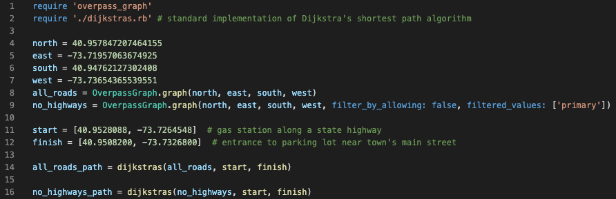

# overpass-graph

## Installation
```
coming soon
```
## Usage
### Basic Usage
To create a graph, use the function `overpass_graph` after requiring the library.
This function takes four required arguments, representing the edges of a bounding box. By default, it will return a weighted, directed graph of all roads and paths within the bounding box.
For example:
```
graph = OverpassGraph.graph(north, east, south, west)
```
In this example:
* `north` is the latitude of the northern edge of the bounding box.
* `east` is the longitude of the eastern edge of the bounding box.
* `south` is the latitude of the southern edge of the bounding box.
* `west` is the longitude of the western edge of the bounding box.

### Graph Representation
`OverpassGraph.graph` will return a graph represented by an adjacency map. The keys are starting vertices and the values are maps of ending vertices to edge lengths. That is, if an edge exists in graph, `g`, from vertex `x` to vertex `y` of length `d`, then `g[x][y]` will equal `d`.

Note that vertices in the graph are any nodes in the set of queried nodes that either: A) are endpoints of a road or B) are present in at least two roads (i.e. intersections).

### Optional Arguments
#### Basic Optional Arguments
`OverpassGraph.graph` takes a number of optional keyword arguments. 
* To make a graph undirected, pass `directed: false` to the function (by default, graphs are directed).
* To make a graph with metric distance values as opposed to imperial, pass `metric: true` to the function (by default, graphs use the imperial system)

#### Filtering
`OverpassGraph.graph` allows you to filter the types of roads contained in the graph. As the library creates graphs using OpenStreetMap (OSM) data, this filtering is done using the OSM data model. By default, the function queries for all *ways* with the key *highway* (OSM's key for identifying any type of road, street or path). You may restrict which *highway* values the function queries for (and hence builds a graph from). This is done in two different ways:
* To specify which *highway* values you would like to build a graph from, pass an array of allowed OSM *highway* values to the filtered values. The following would return a graph built from all the primary and secondary *highway*s in the specified bounding box: 
```
OverpassGraph.graph(..., filtered_values: ['primary', 'secondary'])
```
* To query for all *highway* values except for a specified few which are not allowed, you must pass two keyword arguments to `overpass_graph`. 
    * First, to specify that you wish to prevent certain *highway* values and allow all others, pass the keyword argument `filter_by_allowing: false` to the function. 
    * Second, pass in the not-allowed values to the `overpass_graph` function using the filtered values keyword argument. The following would return a graph with all ways of type *highway* except for 'secondary' *highway*s: 
    ```
    OverpassGraph.graph(..., filter_by_allowing: false, filtered_values: ['secondary'])
    ```

Find out more about the OSM data model and possible keys [here](https://wiki.openstreetmap.org/wiki/Key:highway)

## Under the hood
The algorithm to build the graph works as follows:
* First, it builds the set of vertices in the graph. This is done by processing all coordinates in the set of queried roads. If a coordinate begins or ends a road, or if it is present in more than one road, it will be added to the vertex set.
* Second, it builds the adjacency map, by processing all coordinates again and constructing edges from one vertex to the next vertex based on the sum of the distances between the intervening nodes.

NOTE: the time and space complexity for building the graph are both *O(n)* where *n* is the number of nodes returned by the API call. The API call should take much longer than building the graph.

## Example
Below is an example of using Overpass Graph to generate the shortest path between a gas station (start) and parking lot (finish) in the town of Mamaroneck, NY, under two different circumstances.
1. In the first, a graph is built from all types of roads and paths (i.e. does not filter) in the area.
2. In the second, a graph is built for the same area, but highways are excluded from the graph (more specifically, OSM highways of type 'primary' are excluded).

Here is a short script to build the graphs using Overpass Graph and generate the shortest paths from start to finish using Dijkastra's algorithm.



Below is a visualization of all_roads_path:


And below is a visualization of no_highways_path:


## License
Released under the MIT license. See the [LICENSE](https://github.com/samlawhon/overpass-graph/blob/master/LICENSE.txt) file for further details.
